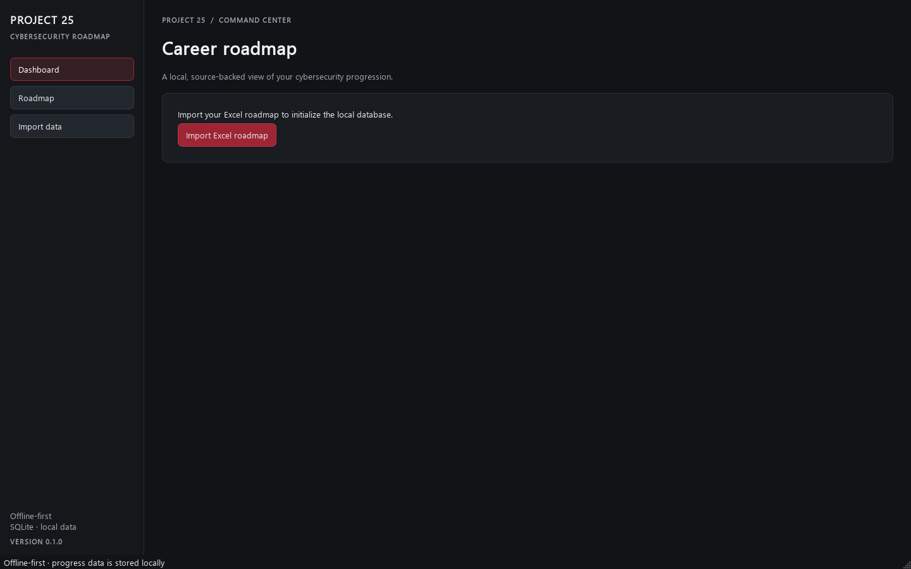

# Cybersecurity Career Roadmap

An offline-first Windows desktop application that turns a user-provided cybersecurity career workbook into a local, structured roadmap. The project is being developed in reviewable releases. **v0.1.0 is the Foundation release.**

The source workbook remains authoritative. The importer stores the source sheets, populated cells, formulas, saved formula values, and source coordinates in SQLite. It also creates normalized records for task-like rows so later releases can add progression features without losing workbook context. The original workbook is opened read-only and is never saved by the application.

## v0.1.0 features

- PySide6 desktop window with Dashboard, Roadmap, and Import data pages
- SQLite storage with a versioned schema
- Excel `.xlsx` and `.xlsm` import
- Source-preserving storage for all visible sheets, values, formulas, cached values, validation ranges, chart references, and source cell locations
- Normalized records for missions, skills, certifications, projects, and learning objectives
- Validation findings for incomplete source rows, formula cycles, inconsistent summary ranges, and workbook structure gaps
- Idempotent re-import of an unchanged workbook
- Local-only user data, excluded from Git

Later features such as editable progress, XP awards, quests, skill trees, achievements, analytics, backup/restore, and Excel export are tracked in [ROADMAP.md](ROADMAP.md). They are not part of v0.1.0.

## Screenshot

The image below shows the data-free first-run screen. The app reads the workbook without modifying it and keeps imported progress data in the user's local SQLite database.



## Installation

Python 3.11 or newer is recommended on Windows 10/11.

```powershell
git clone <repository-url>
cd CybersecurityRoadmap
python -m venv .venv
.\.venv\Scripts\Activate.ps1
python -m pip install -r requirements.txt
python -m app.main
```

On first launch, choose **Import Excel workbook…** and select the roadmap file. The app writes a private SQLite database under `%LOCALAPPDATA%\CybersecurityRoadmap\roadmap.sqlite3`. Set `CYBER_ROADMAP_HOME` to use a different local data directory. The application does not need an account or network access after dependencies are installed.

To import from the command line:

```powershell
python -m app.importers.cli "C:\path\to\Cybersecurity_Roadmap.xlsx"
```

An explicit database can be selected with `--database`. Import findings are also saved in SQLite and shown in the Import data page.

## Build a Windows executable

```powershell
.\scripts\build_windows.ps1
```

The script creates a PyInstaller onedir build at `dist\CybersecurityRoadmap\`. It excludes optional image, accelerated XML, and numerical libraries that this app does not use. A one-file release build and fresh-machine installation checks are planned for the release-candidate stage.

## Development

```powershell
python -m unittest discover -s tests -v
```

The importer and database modules can be tested without starting Qt. The desktop interface requires PySide6.

## Architecture

```text
app/
  config/       Local application paths
  database/     SQLite schema and migrations
  importers/    Excel parsing and validation
  models/       Typed domain records
  services/     Database-backed application queries
  ui/           PySide6 shell, theme, and pages
tests/          Importer and persistence tests
scripts/        Windows packaging helpers
```

The SQLite database is local user data. Do not commit it, the original workbook, credentials, lab secrets, or portfolio evidence. `.gitignore` excludes SQLite files and Excel workbooks by default.

## Contribution

See [CONTRIBUTING.md](CONTRIBUTING.md) for development conventions. The project uses semantic versioning and conventional commit messages. Feature work pauses at each documented review gate before the next planned release begins.

## License

MIT. See [LICENSE](LICENSE).
